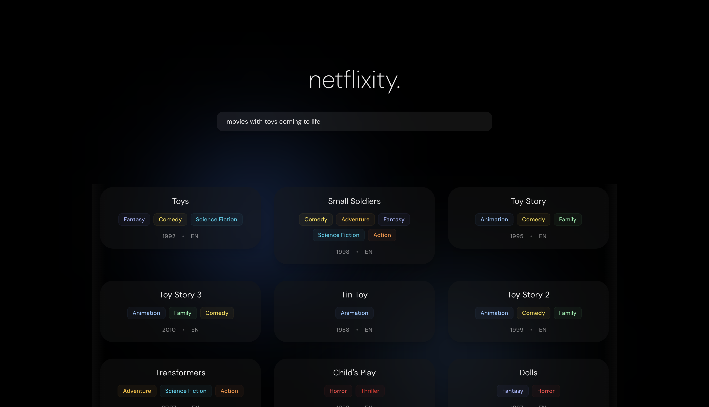

# Netflixity

Think of a story vibe and Netflixity will find a movie based on that. Built with Next.js and pgvector on Supabase, this was a fun project.

[Deployed Website](https://neflixity.vercel.app/)


## Features

- 🎬 Semantic movie search using OpenAI embeddings
- 🔍 Uses pgvector with HNSW indexing over movie descriptor strings

## Project Structure

## Prerequisites

- Node.js (v18 or higher)
- npm or yarn
- OpenAI API key

## Getting Started

1. Clone the repository:

   ```bash
   git clone https://github.com/yourusername/netflixity.git
   cd netflixity
   ```

2. Install dependencies:

   ```bash
   cd client
   npm install
   ```

3. Set up environment variables:
   Create a `.env.local` file in the client directory with:

   ```
   NEXT_PUBLIC_SUPABASE_URL=your_supabase_url
   NEXT_PUBLIC_SUPABASE_ANON_KEY=your_supabase_anon_key
   SUPABASE_SERVICE_ROLE_KEY=your_service_role_key
   OPENAI_API_KEY=your_openai_api_key
   ```

4. Start the development server:

   ```bash
   npm run dev
   ```

5. Open [http://localhost:3000](http://localhost:3000) in your browser.

## Technology Stack

- **Frontend**: Next.js, React, TypeScript, Tailwind CSS
- **Database**: Supabase
- **AI/ML**: OpenAI Embeddings

## Note

- This project inherits from the [Suflix repo](https://github.com/VedantKh/suflix)
